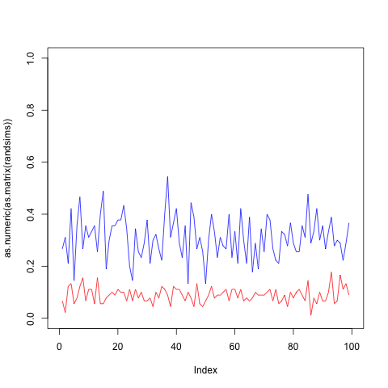
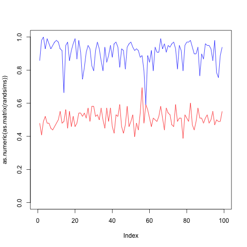

# Usage

```{r}
if (!require('devtools')) install.packages('devtools')
devtools::install_github("abarciauskas-bgse/bplmnist")
library(bplmnist)
```

# Bayesian Programming Learning on MNIST Dataset

**Objective: Predict, using probabilistic program induction, from 10 classes of hand-drawn digit using a single instance of each class**

**Similarities and differences with the omniglot data set:**

The MNIST dataset of hand-drawn integers is comparable to the omniglot dataset of hand-drawn alphabetic characters in that it includes many examples with a high degree of variation. It is the variation across two-dimensions which makes the classification difficult. More explicitly, two vectors of a long series of pixels identifying the same character are very likely to be completely distinct.

For the MNIST dataset, we have simulated the process of the Bayesian Program Learning for the omniglot dataset for predicting new integers using a single example from each class 0-9.

One challenge in simulating this process directly is that the BPL paper used motor data from Amazon Turk: to create the program they used stroke trajectory data, e.g. each hand-drawn image came with trajectory data which informed where the strokes for each character were started and facilitated differentiation of distinct strokes and their relations to each other.

The MNIST dataset do not come with motor data so in what follows a "trajectory" is simulated by a directed-path-generating algorithm that relies highly on heuristics of how characters are drawn. The process here is also simplified by relying  entirely on the directed paths generated from the algorithm and has not incorporated the relations between strokes as part of assessing the posterior probability.

**Deep Thought: Something about deep learning vs BPL**

## The process is as follows:

**1. Create skeleton:** The original image is whittled down to a "one-pixel" skeleton

**2. Generate directed path:** Simulate trajectory using a heuristics-motivated path generating algorithm.

These extracted features enable both new integer generation and integer prediction on test examples. Here we focus on the latter (I thought it was more interesting).

## 1. Create the thinned images

```{r}
data("mnist")
digits <- data
# Select a random subset of digits
# Subset data so to speed things up
rand.idcs <- sample(1:nrow(digits), 100)

# displaying the original digit
for (i in 1:10) {
  digit <- digits[rand.idcs[i],]
  label <- as.numeric(digit[1])
  features <- as.numeric(digit[2:ncol(digit)])
  displayDigit(features, label, newDevice = FALSE)
  Sys.sleep(0.5)
}

thinned.ints <- collect.digit.skeletons(digits[rand.idcs,])
```

### The digit skeletons:

```{r}
for (i in 1:10) {
  plot(thinned.ints[[i]]$points, main = paste0('Hey, this is a: ', thinned.ints[[i]]$label), pch = 19, ylim = c(-16,0), xlim = c(0,16))
  Sys.sleep(0.5)
}
```

### Collect a training set 0-9

```{r}
# returns first 0-9 distinct digits
training.collection <- collect.training.set(thinned.ints)
train.set <- training.collection$train.set
train.idcs <- training.collection$train.idcs
```

### Everything else is in the test set

The size of the test set is `n-10`

```{r}
# Collect the test set
test.idcs <- setdiff(1:length(rand.idcs), train.idcs)
test.set <- thinned.ints[test.idcs]
```

## Train on the training set

"Training" is feature extraction. Features are extracted in two stages:

1. The `generatePaths` algorithm generates a list of "directed strokes" [animation](https://youtu.be/htCA3S_pigk)
2. Directed strokes are used to generate features of the first major stroke

```{r}
train.objects <- list()

for (i in 0:9) {
  digit <- train.set[[which(sapply(train.set, function(dig) { dig$label == i }))]]
  train.objects[[i+1]] <- train.digit(digit)#, animation = TRUE)
}
```

# Prediction

Predict a test digit using Bayes:

P(digit.type = 0 | stroke.data) ~ P(stroke.data | digit = 0) P(digit = 0)

```{r}
(accuracy <- predict.mnist(train.objects, test.set)$accuracy)
```

# 100 simulations




## Questions?

## Resources:

* [Science Magazine: Human-level concept learning through probabilistic program induction](http://science.sciencemag.org/content/sci/350/6266/1332.full.pdf)
* [BPL on github](https://github.com/brendenlake/BPL)
* [Bayesian Programming on Github](https://en.wikipedia.org/wiki/Bayesian_programming)
* [Full paper](http://science.sciencemag.org/content/sci/suppl/2015/12/09/350.6266.1332.DC1/Lake-SM.pdf)
* [hadley/lineprof](http://adv-r.had.co.nz/Profiling.html#measure-perf)


